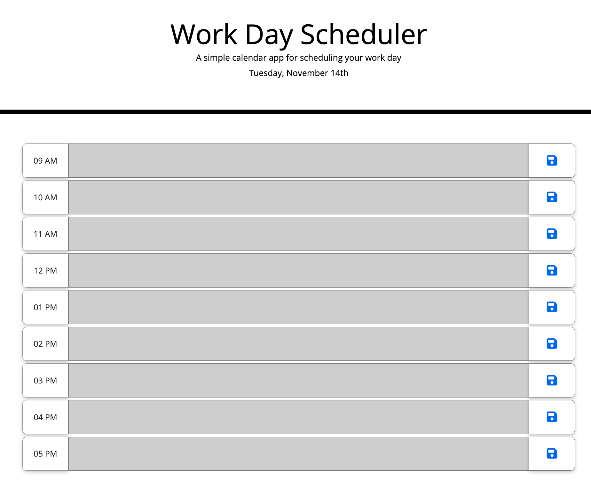
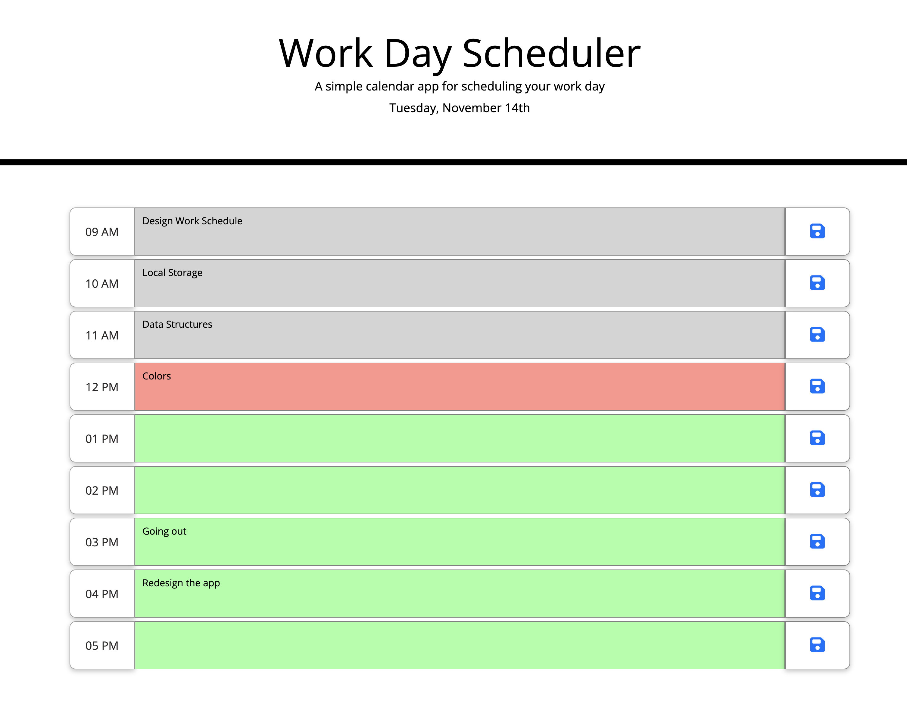

# Work-Day-Scheduler
A simple calendar application that allows a user to save events for each hour of the day. The information will be stored in local storage for the day. The slots are coloured to indicate past, present and future slots.
- **Visit** the application at: 

## Table of Contents

1. [Introduction](#introduction)
2. [Screenshots](#screenshots)
4. [Contact Information](#contact-information)

## Introduction
A simple calendar application that allows a user to save events for each hour of the day. The functionality of the app is listed below:

* Displays the current day at the top of the calender when a user opens the planner.

* Presents timeblocks for standard business hours when the user scrolls down.

* Each timeblock is color-coded based on past, present, and future when the timeblock is viewed.
 
* Allows a user to enter an event when they click a timeblock

* Saves the event in local storage when the save button is clicked in that timeblock.

* Persist events between refreshes of a page

- **Technologies Used**: HTML, CSS, Bootstrap, JavaScript, jQuery

## Screenshots
- **Home Screen**: (without colors as the time of this screenshot is 9PM)

- **Colored slots**:

- **Local Storage**:

## Contact Information

- **Email**: gsgghotra@gmail.com
- **LinkedIn**: [gsgghotra](https://www.linkedin.com/in/gsgghotra/)
